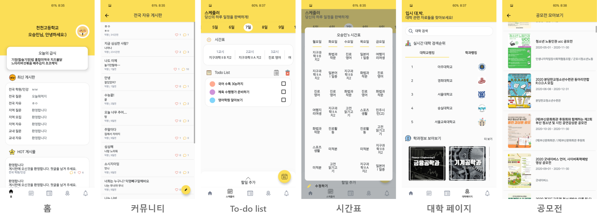
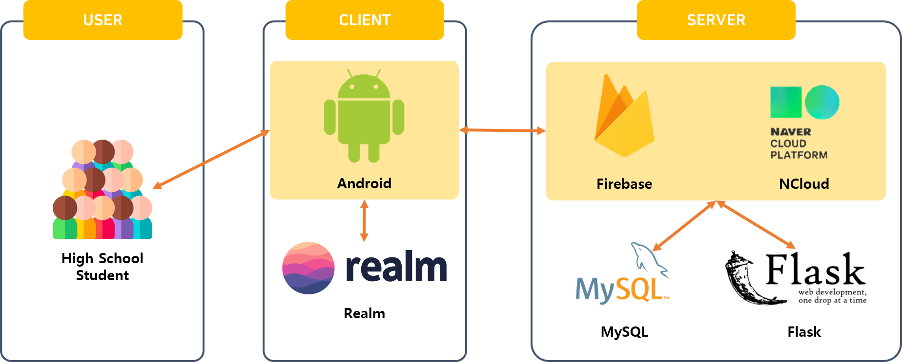

<h1 align="center">
   
  
   
    
   
</h1>

<h4 align="center">고등학생 전용 지역 기반 커뮤니티 & 입시 도우미 모바일 어플리케이션</h4>

  
  
  
  

  <a href="#overview">Overview</a> • 
  <a href="#key-features">Key Features</a> • 
  <a href="#download">Download</a> •  
  <a href="#credits">Credits</a> •   
  <a href="#structure">Structure</a> • 
  <a href="#related">Related</a>

    

## Overview

`도담도담`은 고등학생 전용 지역 기반 커뮤니티 어플리케이션으로 시작했다. 출시 이후, 도담도담은 학생들의 의견을 통해 커뮤니티 이외에도 **급식표**, **시간표**, **To-do list**, **대학 입학처 및 유투브 바로가기** 기능을 통해 고등학생에게 필요한 기능 모두를  한 곳에 모아놓은 고등학생 필수 모바일 어플리케이션으로 거듭나기 위해 노력중이다.

## Key Feature

* 교내, 동네, 전국 커뮤니티

* 급식표
* 시간표
* To-do list
* 커리어넷 학과 정보 소개
* 대학 입학처 사이트 및 유투브 바로가기
* 학과 및 학교 검색 순위

## Download

구글 플레이 스토어에서 최신 버전의 [도담도담](https://play.google.com/store/apps/details?id=com.dum.dodam)을 다운 받거나 또는, [apk파일](app/release/)을 직접 다운 받아 사용할 수 있다.

## Credits

도담도담은 아래의 오픈 소스를 사용하여 제작되었다.

* [Android Studio](https://developer.android.com/studio)
* [N Cloud](https://www.ncloud.com/)
* [Kakao Developer](https://developers.kakao.com/)
* [Flask](https://flask.palletsprojects.com/en/1.1.x/)
* [Realm](https://realm.io/)
* [Retrofit](https://square.github.io/retrofit/)
* [Firebase](https://firebase.google.com/)
* [Glide](https://github.com/bumptech/glide)
* [kizitonwose:CalendarView](https://github.com/kizitonwose/CalendarView)
* [kristiyan:Colorpicker](https://github.com/kristiyanP/colorpicker)

## Structure

## Related

* [dodam-appserver](https://github.com/Algostu/dodam-appserver) : 도담도담 서버

* [도담도담](https://play.google.com/store/apps/details?id=com.dum.dodam) : 도담도담 플레이 스토어
* [d.___.dam](https://www.instagram.com/d.___.dam/) : 도담도담 인스타그램
